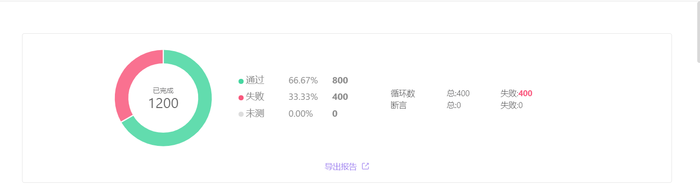
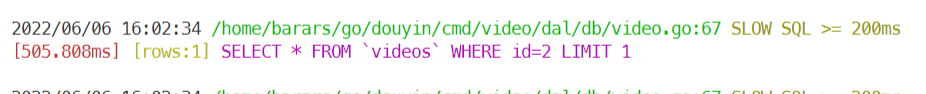

# 青训营抖音评论部分文档

## 对外开放API文档

### /douyin/comment/action/

#### 请求参数

| 参数名       | 位置  | 参数类型 | 必填 | 说明                                          |
| :----------- | :---- | :------- | :--- | :-------------------------------------------- |
| user_id      | query |          | 是   | 用户id                                        |
| token        | query |          | 是   | 用户鉴权token                                 |
| video_id     | query |          | 是   | 视频id                                        |
| action_type  | query |          | 是   | 1-发布评论，2-删除评论                        |
| comment_text | query |          | 否   | 用户填写的评论内容，在action_type=1的时候使用 |
| comment_id   | query |          | 否   | 要删除的评论id，在action_type=2的时候使用     |

#### 返回响应

HTTP 状态码: 200

内容格式: JSON

object

+ status_code——integer——状态码，0-成功，其他值-失败

+ status_msg——string or null——返回状态描述

+ comment_list——array or null——评论列表

  + id——integer——评论id

  + user——object——User

    + id——integer——用户id

    + name——string——用户名称

    + follow_count——integer——关注总数

    + follower_count——integer——粉丝总数

    + is_follow——boolean——true-已关注，false-未关注

  + content——string——评论内容

  + create_date——string——评论发布日期，格式 mm-dd

### /douyin/comment/list/

#### 请求参数

| 参数名   | 位置  | 参数类型 | 必填 | 说明          |
| :------- | :---- | :------- | :--- | :------------ |
| user_id  | query |          | 是   | 用户id        |
| token    | query |          | 是   | 用户鉴权token |
| video_id | query |          | 是   | 视频id        |

#### 返回响应

HTTP 状态码: 200

内容格式: JSON

object

+ status_code——integer——状态码，0-成功，其他值-失败

+ status_msg——string or null——返回状态描述

+ comment_list——array or null——评论列表

  + id——integer——评论id

  + user——object——User

    + id——integer——用户id

    + name——string——用户名称

    + follow_count——integer——关注总数

    + follower_count——integer——粉丝总数

    + is_follow——boolean——true-已关注，false-未关注

  + content——string——评论内容

  + create_date——string——评论发布日期，格式 mm-dd

## 通信 RPC 接口

 ```go
 CreateCommentResponse CreateComment(1:CreateCommentRequest req) // 创建评论
 DeleteCommentResponse DeleteComment(1:DeleteCommentRequest req) // 删除评论
 QueryCommentsResponse QueryComments(1:QueryCommentsRequest req) // 查询评论列表
 QueryCommentNumberResponse QueryCommentNumber(1:QueryCommentNumberRequest req // 查询评论数量
 ```

## 支持功能

+ 发布评论：
  + 仅支持一层回复，即视频下回复，不支持楼中楼回复
  + 仅支持文字编码回复
  + 不支持修改评论
+ 读取评论：按照时间排序（默认分页，每页最多返回10000条评论）
+ 删除评论：评论本人删除
+ 敏感词、评论审核（文字内容安全）：腾讯云安全：1000QPS
+ 拓展需求：（并没有完成，看个乐呵）
  + 如果拓展成为评论框架或者评论中台，需要添加人工管理相关功能，包括数据检索、导出、人工审核和删除等功能
  + 评论点赞、按照赞数排序读取评论

## 架构图


（来源见水印）

## 数据库表格

### MySQL数据表1定义：

```sql
CREATE TABLE comment_index
(
  id                BIGINT  NOT NULL AUTO_INCREMENT COMMENT '自增主键',
  v_id              BIGINT  NOT NULL COMMENT '视频ID',
  comment_number    BIGINT  NOT NULL COMMENT '评论数量',  
  create_time       BIGINT  NOT NULL COMMENT '创建时间',	
  PRIMARY KEY (id),
  index undex_vid(v_id),
  index index_createTime(create_time)
) ENGINE=InnoDB;
```

### MySQL 数据表2定义：

```sql
CREATE TABLE comment
(
  id                BIGINT  NOT NULL AUTO_INCREMENT COMMENT '自增主键',
  c_id  			BIGINT  NOT NULL COMMENT '评论ID'
  u_id              BIGINT  NOT NULL COMMENT '用户ID',
  v_id              BIGINT  NOT NULL COMMENT '视频ID',
  state             INT     NOT NULL COMMENT '状态（0-正常，1-隐藏）',
  content           TEXT    NOT NULL COMMENT '评论内容',
  create_time       BIGINT  NOT NULL COMMENT '创建时间',	
  PRIMARY KEY (id),
  index undex_vid(v_id),
  index index_createTime(create_time)
) ENGINE=InnoDB;
```

### redis 缓存定义

`key`：视频`ID`

`value`：序列化的`mysqldb.Comment`结构和评论数量

## 错误码定义

+ 0：成功
+ 40001：服务本身、框架的 API 相关错误
+ 40002：评论格式错误、内容有问题（评论不能为空、敏感信息等）
+ 40003：用户 ID 错误、缺失
+ 40004：视频 ID 错误、缺失
+ 40005：评论 ID 错误、缺失

## curl 测试命令

```bash
curl --location --request POST 'localhost:8086/douyin/user/register?username=123456&password=123456' | jq  
curl --location --request POST 'localhost:8086/douyin/comment/action?token=...&video_id=1&action_type=1&comment_text=测试1' | jq
curl --location --request POST 'localhost:8086/douyin/comment/action/?token=...&video_id=1&action_type=2&comment_id=164147794808832' | jq
curl --location --request GET 'localhost:8086/douyin/comment/list?token=...&video_id=1' | jq
```

## 使用到的开源库

[sarama](https://github.com/Shopify/sarama)：简单易用的 kafka 第三方 Golang 库

[kitex](https://github.com/cloudwego/kitex)：字节开源 RPC 框架

[go-redis/redis](https://github.com/go-redis/redis)：Golang redis 操作库

[zap](https://github.com/uber-go/zap)：uber 开源的高效日志库

[lumberjack](https://github.com/natefinch/lumberjack)：zap 推荐的日志文件管理库

[Jaeger](https://github.com/jaegertracing/jaeger)：uber 开源的基于 opentracing 链路追踪工具

[gorm](https://github.com/go-gorm/gorm)：简单易用的 Golang ORM 库

[viper](https://github.com/spf13/viper)：Golang 配置文件导入库

## 实现细节

### redis 缓存实现

+ 简单的在查询时如果缓存未命中，发送一个消息，收到后在 redis 中创建一个12小时的缓存。
+ 如果评论数据发送更新，则数据库更新后发送信息更新缓存。
+ 关于一致性：在我对这个业务的理解中，每个人发评论对于自身评论是更加关注的，而对于同时间发送评论人的评论并不关心，所以在客户端方面实现一个服务端确认后增加自己评论数目的功能就已经满足了需求，而后端的主要任务就是处理大量的数据并保证缓存的同步，同时这个同步可以慢一些，并不需要即时完成（但需要保证数据的可靠性，保证评论内容一定写入数据库之中，同时完成同步）

### 归并回源实现

+ 利用 go 官方的 singleflight 包实现同一时段相同请求的合并，互联网黑话——归并回源，具体实现和用法参考 go 官方文档。
+ 在评论系统中，主要在查询评论列表、查询评论数量、删除评论这三个服务上引入这个特性，也即这三个服务操作本身具有幂等性（互联网黑话又一，其本质就是多次执行同一操作结果和后台数据不变）

### 消息队列作用

+ 将可能巨大的对数据库的写流量缓冲下来，减少数据库压力。
+ 将数据库写操作独立出来后，可以单线程消费，以解决我这个简单（垃圾）的redis缓存的一致性问题。
+ 可以在写数据和缓存层面上实现对存储层的解耦（简单理解就是可以随时更换下面的存储引擎，不需要对服务层说明，服务层只需要按照一定格式向消息队列发送消息就可以了）。（这个特性在存储层实现读写分离后会更加明显，收益更高）

### 关于日志选用 zap 而不顺手使用 klog 的原因

+ zap 及其推荐第三方库对于文件日志的支持更加全面，通过简单配置就可以实现了日志文件的大小限制、超大小后自动新建文件、日志存储时间、超时自动删除、分级日志写入等管理功能，而 klog 没有这样功能抑或实现较为麻烦。
+ zap 对于日志格式的自定义个人比较喜欢，也可以比较简单的使用和易读（代码的可读性）。（个人原因，非功能考虑）

（然后好像没什么细节了，想到在补充）

## 系统测试

服务器小水管，跑不起 docker 需要组件，只能本机测试。

但本机也由于电脑性能太差，也跑不了中等的流量测试（跑个200线程3请求的测试就直接卡关机了），所以只能跑个低流量测试看看了。（工作以后可能第一件事情就是换电脑）

100线程每个线程3个请求测试结果：



[详细测试结果](./doc/apifox-reports-2022-06-06-16-04-02.html)

结果分析：

详细看测试结果会发现大部分失败集中于获取评论列表，且错误码非 4 开头，是以 1 开头的，我认为原因可能如下（根据控制台日志和调用错误码推断，不代表真实情况）：

+ 由于缓存部分时间较长，为保证用户数据实时性，只缓存了用户id，导致每次获取评论列表时都需要重新获取用户信息，导致用户服务触发 CPU 利用率限制，导致服务失败。

+ 原因同上，流量触发了用户服务 kitex 限流？（应该没这么小吧）

+ 触发了 gin 的一些限流措施？（虽然流量这么小，不过像上面一样的话或许可能会触发吧）

意外收获，在一定流量的时候，视频服务的大量慢SQL语句，如下图：



## 改进方向

+ mysql 读写分离，主从同步。
+ 实现一个更加完整、稳定、高效的缓存中间件（包含更加细致完整的缓存淘汰算法等等可以改进的地方）。
+ 功能方面向拓展需求演进。
+ 将消息队列的确认消息机制改为异步确认（猜测和消息队列生产者执行时间抖动有关）。
+ 数据写入可靠性的研究、灾容恢复？（这点是真的不熟，需要进一步研究）
+ ...(待补充)
